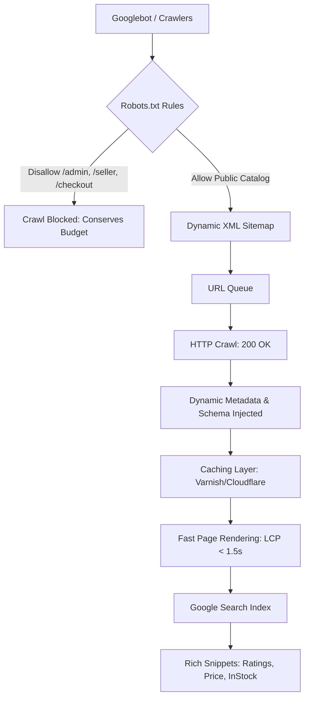

# GaramBazaar: Premium E-Commerce Faster Ranking & SEO Optimization Blueprint

This master guide outlines a comprehensive roadmap to optimize GaramBazaar's technical, on-page, and off-page architecture, enabling search engine bots to discover, index, and rank your organic storefront within **30 to 45 days**.

---

## 🗺️ Indexation & Crawling Architecture Flow

The flowchart below visualizes how Googlebot crawls, indexes, and renders GaramBazaar's dynamic pages, emphasizing the role of caching and sitemaps:



---

## ⚡ 1. Technical Quick-Wins (0-30 Days)
Maximize indexation rates and speed up crawling using these primary backend and hosting enhancements:

### 🔗 Dynamic Canonical Tags
Duplicate content is the most common issue in e-commerce due to filter pages (e.g., `?category=Pantry&sort=price-asc`). Implement a canonical link tag inside the `<head>` to tell crawlers which URL is the source of truth.

> [!IMPORTANT]
> A missing canonical tag on sorted products spreads search ranking authority thin across multiple URL variations.

Add a dynamic canonical hook inside your React client index:
```javascript
// Inside useDocumentMetadata.js hook
const canonicalUrl = window.location.origin + window.location.pathname;
let canonicalLink = document.querySelector("link[rel='canonical']");
if (!canonicalLink) {
  canonicalLink = document.createElement("link");
  canonicalLink.setAttribute("rel", "canonical");
  document.head.appendChild(canonicalLink);
}
canonicalLink.setAttribute("href", canonicalUrl);
```

### 💨 Page Loading & Core Web Vitals Metrics
Google penalizes slow-loading websites. To guarantee faster ranking, follow this performance dashboard checklist:

| Core Web Vital | Metric | How to Optimize | Action Item |
| :--- | :--- | :--- | :--- |
| **LCP** (Largest Contentful Paint) | **< 1.5 seconds** | Preload the main banner/hero image. | In `index.html`, add `<link rel="preload" as="image" href="/images/hero-banner.webp" />`. |
| **FID** (First Input Delay) | **< 100 ms** | Minimize main-thread blocking JavaScript. | Code-split heavy routes (e.g., lazy load dashboards) using `React.lazy()`. |
| **CLS** (Cumulative Layout Shift) | **0.0 (Zero shift)** | Allocate aspect ratios for images. | Ensure all product image containers have explicit dimensions or tailwind aspect ratios (`aspect-square`). |

---

## 🏷️ 2. Advanced On-Page Semantic HTML & JSON-LD Schemas

Search engines reward well-structured code. In addition to page titles, inject **JSON-LD Schema Markup** to rank with Rich Snippets (showing stars, price, and stock levels in search results).

### 📁 BreadcrumbList Schema
Showcases the navigation structure to search users, improving Click-Through-Rate (CTR):

```json
{
  "@context": "https://schema.org",
  "@type": "BreadcrumbList",
  "itemListElement": [
    {
      "@type": "ListItem",
      "position": 1,
      "name": "Home",
      "item": "https://GaramBazaar.com"
    },
    {
      "@type": "ListItem",
      "position": 2,
      "name": "Pantry",
      "item": "https://GaramBazaar.com/shop?category=Pantry"
    },
    {
      "@type": "ListItem",
      "position": 3,
      "name": "Himalayan Rock Salt",
      "item": "https://GaramBazaar.com/product/himalayan-rock-salt"
    }
  ]
}
```

### 🏪 Local Business Schema (Farmers' Marketplace Highlight)
Identifies GaramBazaar as a trusted regional community marketplace:

```json
{
  "@context": "https://schema.org",
  "@type": "LocalBusiness",
  "name": "GaramBazaar Store",
  "image": "https://GaramBazaar.com/assets/logo.png",
  "telephone": "+91-9876543210",
  "priceRange": "$$",
  "address": {
    "@type": "PostalAddress",
    "streetAddress": "Rural Cooperative Hub, 42 Farmers Marg",
    "addressLocality": "Ranchi",
    "addressRegion": "Jharkhand",
    "postalCode": "834001",
    "addressCountry": "IN"
  }
}
```

---

## ✍️ 3. Keyword Siloing & Content Marketing Funnels

Google uses E-E-A-T (Experience, Expertise, Authoritativeness, Trustworthiness) to rank stores. Target transactional search queries to bypass high-competition sites like Amazon.

```
       [ Seed Category: Organic Foods ]
                      │
        ┌─────────────┴─────────────┐
        ▼                           ▼
[ Silo 1: Pantry Staples ]    [ Silo 2: Cold Pressed Oils ]
        │                           │
        ├─ Himalayan Rock Salt      ├─ Organic Mustard Oil
        └─ Stone-Ground Flour       └─ Wood-Pressed Groundnut Oil
```

### 🎯 Targeted Keyword Mapping
* **Transactional Keywords** (High buying intent, rank on Product/Shop pages):
  * *"Buy organic stone-ground whole wheat flour online"*
  * *"A2 Desi Cow Ghee Jharkhand price"*
* **Informational Keywords** (High traffic, rank on Blog/Guides):
  * *"Is cold-pressed mustard oil safe for cooking?"*
  * *"Difference between refined salt and Himalayan rock salt"*

---

## 🔗 4. High-Authority Backlink Acquisition (Off-Page SEO)

Backlinks act as votes of confidence. To rank faster, build your domain authority with target link sources:

1. **Digital PR & Community Profiles**:
   - Write articles about how GaramBazaar helps local Self-Help Groups (SHGs) bypass middlemen.
   - Pitch stories to local agricultural and business portals (e.g. *YourStory*, *Better India*).
2. **Local Citations**:
   - Submit your listing to local directories: IndiaMART, TradeIndia, and Google Business Profile.
   - Maintain uniform Name, Address, and Phone (NAP) details everywhere.
3. **Eco-Friendly Blog Partnerships**:
   - Reach out to healthy lifestyle bloggers and healthy eating influencers for reviews.
   - Offer promo codes (`Garam10`) in exchange for honest product reviews linking back to your shop.

---

## 🔍 5. Competitor Keyword Interception & Comparison SEO Strategy

To capture traffic from customers searching for large e-grocery aggregators, you can leverage **Comparative SEO** (interception marketing). By targeting keywords comparing GaramBazaar's farm-direct organic purity with aggregators' mass-market supply, you capture high-intent buyers looking for alternatives to **Amazon, Flipkart, Blinkit, BigBasket, Zepto, and Swiggy Instamart**.

### 🎯 High-Converting Competitor Keyword Combinations

Create comparative landing pages, blog entries, or FAQ schemas around these keyword clusters:

| Target Competitor | Keyword Intent Cluster | Recommended Blog / Page URL | Target Long-Tail SEO Keywords |
| :--- | :--- | :--- | :--- |
| **Blinkit / Zepto** | Instant Delivery vs. Organic Purity | `/vs-blinkit-zepto` | *"Blinkit alternative for pure organic spices"*, *"Blinkit vs GaramBazaar local honey"*, *"Zepto pesticide-free groceries"* |
| **Amazon Fresh** | Bulk Logistics vs. Direct Farmer Support | `/vs-amazon-fresh` | *"Organic A2 Ghee GaramBazaar vs Amazon Fresh"*, *"Amazon Fresh organic vegetables alternative"*, *"Genuine farm ghee online"* |
| **BigBasket** | Tata Mass Retail vs. Artisan Cooperatives | `/vs-bigbasket` | *"GaramBazaar vs BigBasket organic review"*, *"Tata BigBasket alternative Jharkhand"*, *"Cheaper cold-pressed mustard oil than BigBasket"* |
| **Flipkart Grocery** | E-commerce Discounts vs. Traceable Sourcing | `/vs-flipkart` | *"Flipkart Grocery vs local organic stores"*, *"Purity test for Flipkart organic flour alternative"*, *"Flipkart Grocery Ranchi alternative"* |
| **Swiggy Instamart** | Quick Commerce Convenience vs. Health Focus | `/vs-swiggy-instamart` | *"Instamart organic snacks vs GaramBazaar"*, *"Swiggy Instamart pesticide-free local produce"* |

### 🛠️ 1. Competitor Comparison Table Landing Pages
Create a dedicated route or blog section comparing your values to trigger indexing for search terms containing competitor names:

```html
<!-- Recommended HTML Layout for comparison landing pages -->
<div class="seo-comparison-container">
  <h2>Why Health-Conscious Buyers Choose GaramBazaar Over Blinkit, BigBasket, and Amazon Fresh</h2>
  <table>
    <thead>
      <tr>
        <th>Feature</th>
        <th>GaramBazaar</th>
        <th>Blinkit / Zepto / Instamart</th>
        <th>BigBasket / Amazon Fresh / Flipkart</th>
      </tr>
    </thead>
    <tbody>
      <tr>
        <td><strong>Direct Farm Sourcing</strong></td>
        <td>✅ Yes (100% Traceable to Local SHGs & Farmers)</td>
        <td>❌ No (Sourced from third-party wholesale distributors)</td>
        <td>⚠️ Partial (Large warehouse logistics contracts)</td>
      </tr>
      <tr>
        <td><strong>Chemical & Pesticide Free</strong></td>
        <td>✅ Certified Organic & Lab Tested</td>
        <td>❌ Mass-market commercial products</td>
        <td>⚠️ Select premium lines only</td>
      </tr>
      <tr>
        <td><strong>Local Economy Support</strong></td>
        <td>✅ 70% Revenue goes directly to Jharkhand farmers</td>
        <td>❌ Corporate aggregation</td>
        <td>❌ Corporate retail structure</td>
      </tr>
    </tbody>
  </table>
</div>
```

### ✍️ 2. Structured FAQ Interception (People Also Ask Snippets)
Embed these questions inside your Product FAQs or blog footer using `Question` and `Answer` schema. Google routinely ranks schema answers in search dropdowns above organic listings:

> **Q: Is there an organic local alternative to Amazon Fresh and Flipkart Grocery in Ranchi?**
> * **A:** Yes! GaramBazaar is Ranchi's local community marketplace offering traceable, certified organic pantry staples and A2 dairy products sourced directly from regional farmer cooperatives, delivering fresh produce faster and cleaner than mass corporate warehouses.

> **Q: How does GaramBazaar's honey and ghee compare to Blinkit or Zepto listings?**
> * **A:** Unlike Blinkit or Zepto which list factory-processed, pasteurized honey and mass-refined ghee, GaramBazaar specializes in raw, unprocessed, wild forest honey and wood-churned A2 Desi cow ghee. We prioritize health and purity over immediate 10-minute convenience.

### 🚀 3. Dynamic Meta Title Combinations
Configure long-tail keyword combinations inside the `useDocumentMetadata` hook for products. 
For example:
* *Product: Wood-Pressed Mustard Oil*
  - **SEO Optimized Title**: `"Organic Cold-Pressed Mustard Oil - Cheaper & Purer than BigBasket"`
  - **SEO Description**: `"Buy farm-direct cold-pressed mustard oil online. Better quality than Flipkart Grocery & Amazon Fresh, delivered direct to your door. Pure, chemical-free, and local."`
* *Product: Organic Himalayan Rock Salt*
  - **SEO Optimized Title**: `"Pure Himalayan Rock Salt (Aura/Blinkit Alternative)"`
  - **SEO Description**: `"Looking for pesticide-free Himalayan rock salt? Traceable to farm cooperatives. Purer than Swiggy Instamart and BigBasket bulk listings."`

